# 图像局部放大脚本

可对图像进行局部放大，并对放大区域绘制矩形框，支持同时处理多张图像、任意放大倍率，并且可以将放大区域放置在图像的任何角落。

<div style="display: flex;">
    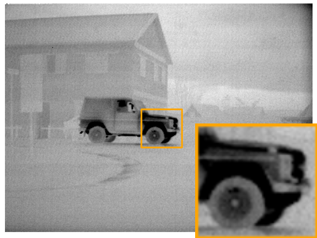
    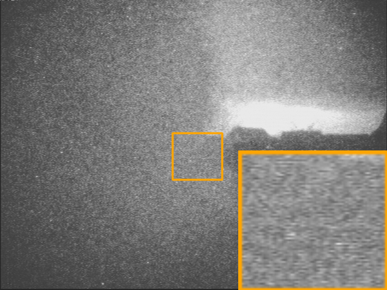
    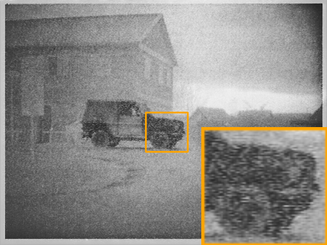
</div>

## 特点

- **同时处理**: 支持同时处理多张图像。
- **任意放大倍率**: 允许用户指定任意的放大倍率。
- **灵活的放置**: 支持将放大区域放置在图像任意角落。


<div style="display: flex;">
    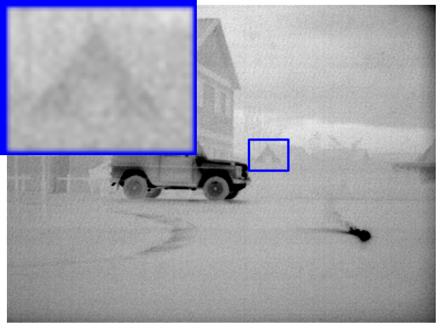
    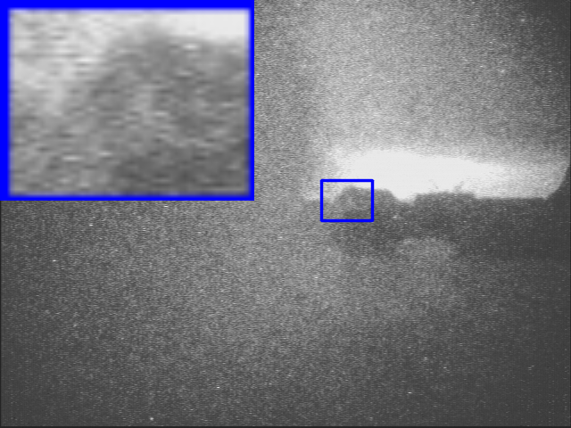
    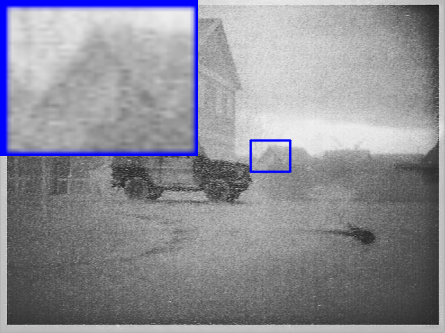
</div>


## 用法

1. 确保已经安装```python```和```opencv-python```
2. 将需要画框的图像都放入同一文件夹
3. 设置脚本的参数
```
directory: (your_image_path)
save_subdir: (save_folder)
scale_factor: (enlarge_ratio) 
loacte: (location_of_patch)
```
4. 运行 ```python draw_box_scale.py``` 

## 只画矩形框
<div style="display: flex;">
    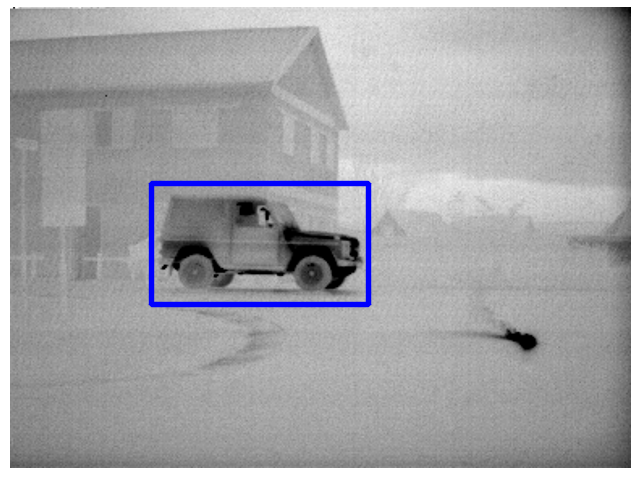
    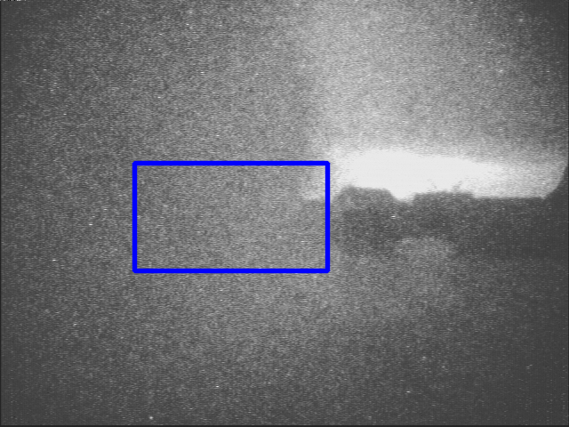
    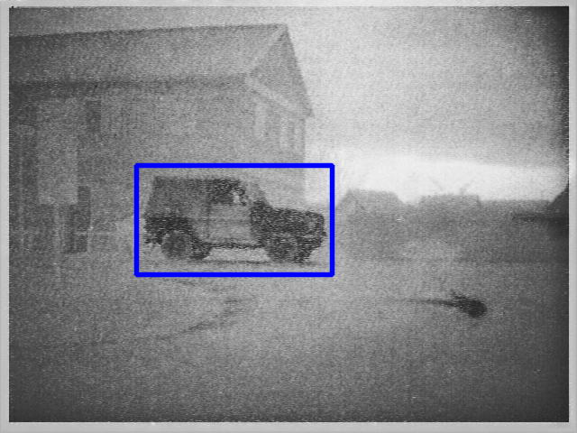
</div>
如果只需要在图像上绘制矩形框，运行```python draw_box.py```即可。


## 放大区域放在旁边（右面或下面）
<div style="display: flex;">
    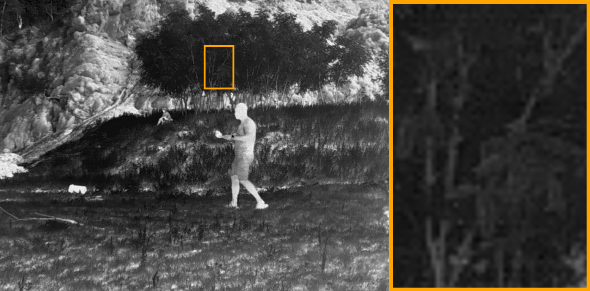
    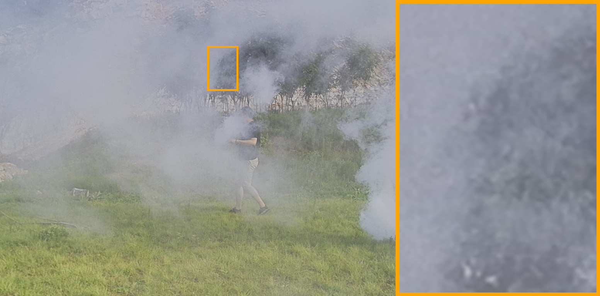
    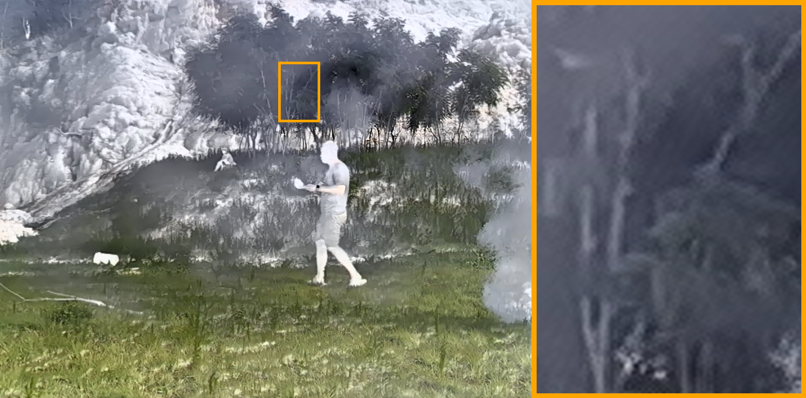
</div>
如果只需要在图像上绘制矩形框，运行```python draw_box_side.py```即可。


## 单独保存放大区域
源图像
<div style="display: flex;">
    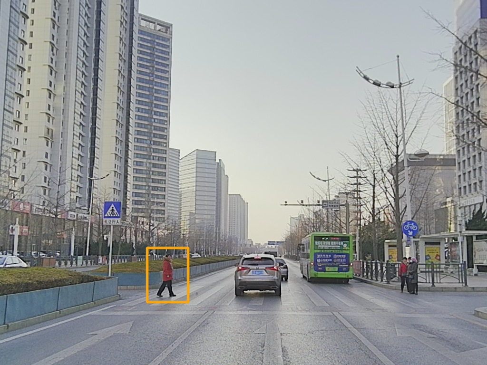
    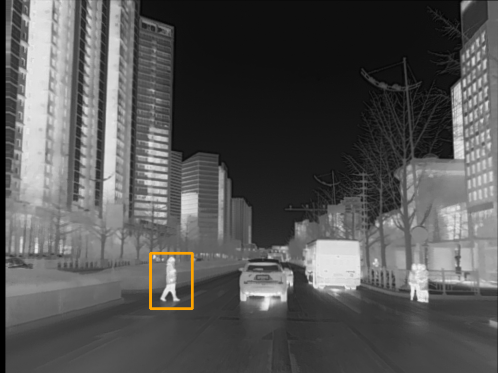
</div>
单独保存的放大区域
<div style="display: flex;">
    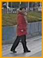
    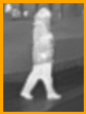
</div>
如果只需要在图像上绘制矩形框，运行```python draw_box_save.py```即可。